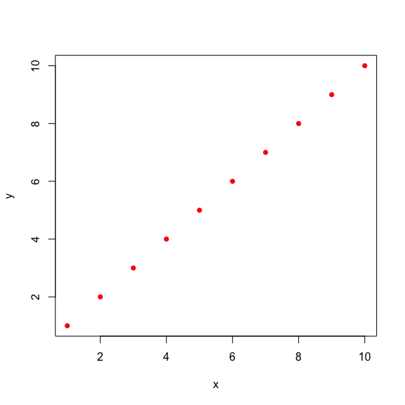
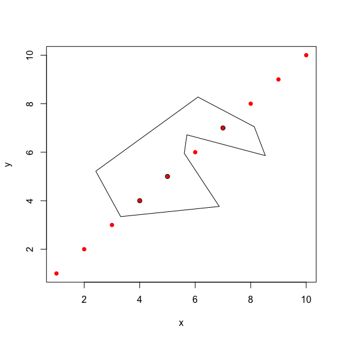

Select points by drawing a freehand gate
================
Wajid Jawaid
14 November 2016

<!-- README.md is generated from README.Rmd. Please edit that file -->


**gatepoints** provides an easy to use function, **fhs** (freehand select) for gating or selecting points freehand on a plot. Take the simple plot below:

``` {.r}
x <- data.frame(x=1:10, y=1:10, row.names = 1:10)
plot(x, pch = 16, col = "red")
```



``` {.r}
plot(x, pch = 16, col = "red")
selectedPoints <- fhs(x, mark = TRUE)
```

To select an arbitrarily complex region run the above commands and proceed as follows:

1.  Mark region of your choice by **left clicking** around your region of interest.
2.  **Close polygon by right clicking**



The names of the points as given by the rownames of the data frame **x** will be returned in **selectedPoints**. Additionally the points can be marked as defined by the user with additional parameters passed to the **points** function.

``` {.r}
selectedPoints
#> [1] "4" "5" "7"
```
